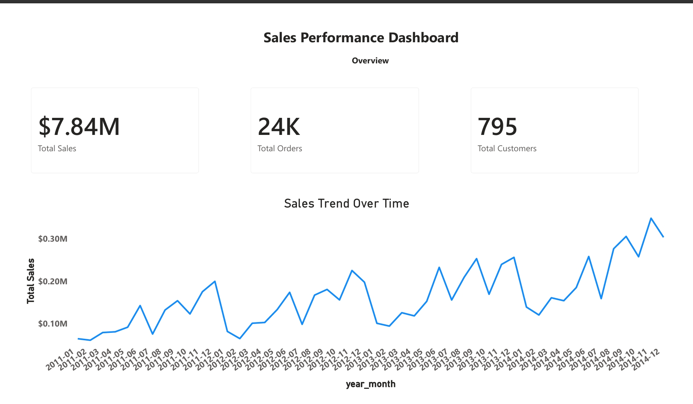
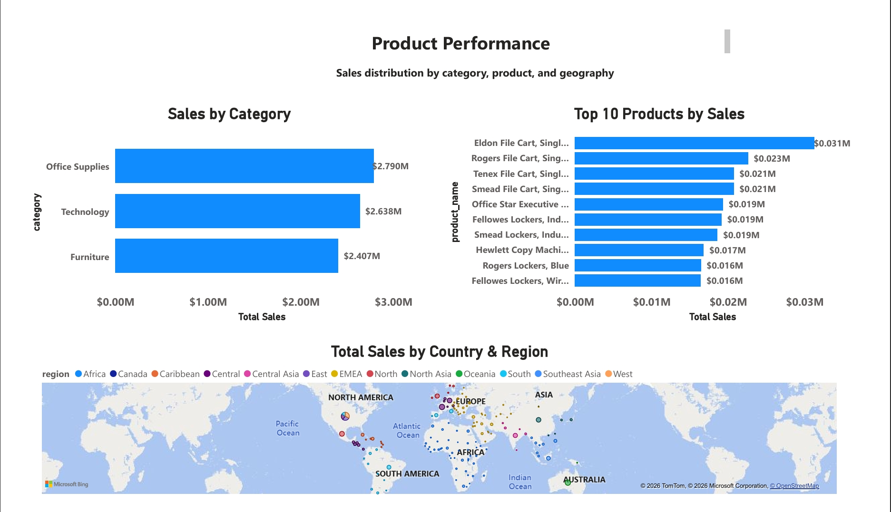
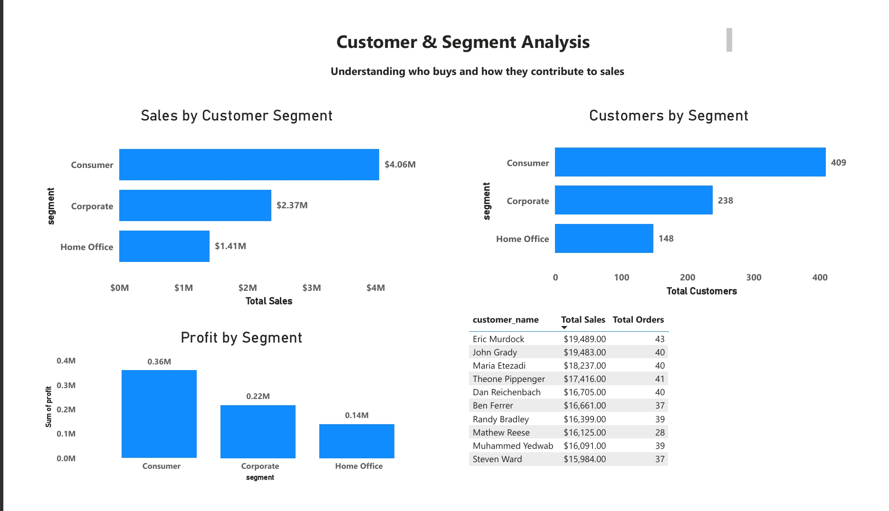

# Sales Performance Dashboard (Power BI)

## 📌 Project Overview
This project is an interactive **Sales Performance Dashboard** built using **Power BI**.  
The dashboard analyzes sales data to uncover insights about **revenue trends, product performance, customer segments, and geographic distribution**.

The goal of this project is to support **data-driven decision-making** by presenting clear, business-focused insights in an executive-friendly format.

---

## 🎯 Business Questions Answered
- What is the overall sales performance over time?
- Which product categories and products generate the most revenue?
- Which regions and countries contribute the highest sales?
- Which customer segments drive sales and profit?
- Who are the top customers by sales?

---

## 🛠️ Tools & Technologies Used
- **Power BI** – Data modeling, DAX measures, and dashboard creation  
- **Python (Pandas)** – Data cleaning and preprocessing  
- **GitHub** – Version control and portfolio presentation  

---

## 📊 Dashboard Overview

### 1️⃣ Overview

**Purpose:**  
Provides a high-level snapshot of business performance using KPIs and a sales trend over time.

**Key Insights:**
- Total Sales, Orders, and Customers at a glance  
- Sales trend helps identify growth patterns and seasonality  

---

### 2️⃣ Product Performance

**Purpose:**  
Analyzes product and geographic performance to identify revenue drivers.

**Key Insights:**
- Top-performing product categories and products  
- Geographic distribution of sales by country and region  
- Clear identification of high-revenue markets  

---

### 3️⃣ Customer & Segment Analysis

**Purpose:**  
Examines customer behavior and profitability across segments.

**Key Insights:**
- Comparison of sales, customer count, and profit by segment  
- Identification of the most profitable customer segments  
- Top 10 customers by sales for key account focus  

---

## 📈 Key Insights Summary
- A small number of products and customers contribute a large share of total revenue  
- Some customer segments generate high sales but lower profit, highlighting optimization opportunities  
- Sales performance varies significantly by region, supporting targeted regional strategies  

---

## 🚀 How to Use This Dashboard
1. Download the Power BI file from this repository  
2. Open it using **Power BI Desktop**  
3. Use slicers and filters to explore sales trends, products, customers, and regions interactively  

---

## 📬 Author
**Sulemana Malik**  
Junior Data Analyst | Power BI | Python | Data Visualization

